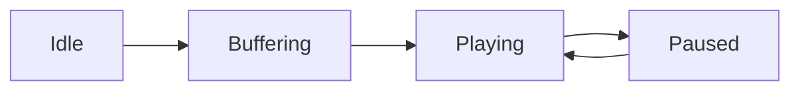

# Plan 005: Implement AI Narration-Optimized Document Adapter with Gemini 3.5 Flash Lite

> **Executor instructions**: Follow this plan step by step. Run every
> verification command and confirm the expected result before moving to the
> next step. If anything in the "STOP conditions" section occurs, stop and
> report — do not improvise. When done, update the status row for this plan
> in `plans/README.md`.

## Status

- **Priority**: P2
- **Effort**: M
- **Risk**: LOW
- **Depends on**: none
- **Category**: feature
- **Planned at**: commit `779639b`, 2026-09-09

## Why this matters

Technical Markdown documents contain structures that degrade speech synthesis when read verbatim or naively stripped:
1. **Markdown Tables**: Row-and-column pipe syntax (`| Col | Col |`) becomes nonsensical or repetitive line noise in audio.
2. **Code Snippets**: Raw braces, semicolons, and syntax tokens (`const res = await ai.models...`) sound robotic and distract from comprehension.
3. **Mermaid Diagrams**: Architecture diagrams and state graphs (`graph LR`, `Idle --> Buffering`) are either skipped or read as raw ASCII identifiers.
4. **File Paths & Links**: Nested directory paths (`src/audio/player/playback-engine.ts`) and Markdown link syntax (`[label](url)`) benefit from fluent phonetic phrasing and natural references to target resources rather than raw URLs.

This plan introduces an opt-in document preprocessor, `GeminiNarrationAdapter`, powered by `gemini-3.5-flash-lite`. It transforms technical Markdown into fluent, conversational narration scripts before passing text to the Gemini Flash TTS audio pipeline or saving it as a standalone script.

## Empirical Verification with `gemini-3.5-flash-lite`

A live prototype test was executed using `@google/genai` against `gemini-3.5-flash-lite` with a representative technical document containing all target elements:

### Test Input Document
```markdown
# Audio Studio Architecture

See the [architecture design](https://internal.corp.goog/docs/audio-studio) for details.
All state changes flow through `src/audio/player/playback-engine.ts`.

## State Lifecycle



## Component Matrix

| Component | Path | Responsibility |
| :--- | :--- | :--- |
| Engine | `src/audio/engine.ts` | Manages PCM playback buffer |
| Watcher | `src/studio/watcher.ts` | Watches filesystem transcripts |

## Audio Configuration Example

```typescript
const engine = new PlaybackEngine({
  sampleRate: 24000,
  channels: 1,
});
await engine.loadTrack('track-01');
engine.play();
```
```

### Actual Output from `gemini-3.5-flash-lite`
```text
Welcome to the Audio Studio Architecture guide. For additional background, you can consult the internal audio studio architecture design documentation. 

At the core of the system, all state changes flow through the playback engine module, located in source, audio, player, playback engine dot T-S.

Let's look at the state lifecycle. The audio engine moves through a clear progression, transitioning from an idle state to buffering, and then into active playback. From the playing state, it can be paused, and subsequently resumed back to playing.

The system is built on key components. The core Engine, located at source, audio, engine dot T-S, manages the P-C-M playback buffer. Alongside it, the Watcher component, found at source, studio, watcher dot T-S, monitors filesystem transcripts for changes.

Here is an example of how to configure and use the audio engine. You initialize the playback engine with a configuration specifying a sample rate of twenty-four thousand hertz and a single audio channel. Once initialized, you asynchronously load a track named track-zero-one, and then invoke the play method to begin playback.
```

The output proves that `gemini-3.5-flash-lite`:
- Seamlessly translated the Mermaid diagram into a sequential description of states and transitions.
- Converted the markdown table into natural conversational prose describing roles and responsibilities.
- Translated the TypeScript code snippet into conceptual explanations without reading braces or punctuation.
- Spoke file paths phonetically ("source, audio, player, playback engine dot T-S").
- Replaced the Markdown link with a natural reference to the target design documentation.

---

## Two Execution Modes: Subscription vs. Metered API

Users can generate narration-optimized documents through two complementary paths:

```
┌─────────────────────────────────────────────────────────────────────────────┐
│ 1. Agent / Subscription Mode (/listen generate)                             │
│    • Executed by Antigravity Agent using the user's subscription ($0 API cost) │
│    • Invocations: /listen generate or /listen generate <file.md>            │
│    • Adapts previous chat turn or reads file and emits .narration.md        │
└─────────────────────────────────────┬───────────────────────────────────────┘
                                      │
                                      ▼
┌─────────────────────────────────────────────────────────────────────────────┐
│ 2. Pipeline / CLI Mode (mdmedia audio --narration / mdmedia adapt)          │
│    • Executed programmatically or in scripts using metered GEMINI_API_KEY   │
│    • Powered by gemini-3.5-flash-lite for ultra-fast, low-cost adaptation   │
│    • Automatically pre-processes Markdown before feeding Gemini Flash TTS   │
└─────────────────────────────────────────────────────────────────────────────┘
```

### Path 1: In-Agent Subscription Mode (`/listen generate`)
- Users invoke `/listen generate` directly in Antigravity chat (e.g. `/listen generate` on the previous response, or `/listen generate docs/architecture.md`).
- Handled via `listen` skill (`~/.gemini/config/skills/listen/SKILL.md`).
- The agent performs the adaptation using its built-in model under the user's subscription, writing `<filename>.narration.md`.
- **Zero metered API tokens charged to the user's Google Cloud project.**
- `AntigravityWatcher` and `listen-parser` parse `mode: 'generate'`, acknowledging the generation without triggering immediate audio playback of the command itself.

### Path 2: CLI & Headless Pipeline Mode (`mdmedia` + `GEMINI_API_KEY`)
- Used for automated CLI pipelines, CI/CD, or batch script generation.
- Uses `gemini-3.5-flash-lite` via `@google/genai` with a metered API key.
- Controlled via `mdmedia.json` and CLI flags.

---

## Configuration & CLI Design

### 1. `mdmedia.json` Configuration
Add an opt-in `narration` section to `.mdmedia.json`:

```json
{
  "audio": {
    "voice": "Puck",
    "model": "gemini-3.1-flash-tts-preview"
  },
  "narration": {
    "enabled": false,
    "model": "gemini-3.5-flash-lite"
  }
}
```

### 2. CLI Flags
Support both in-flight narration during audio synthesis and standalone script generation:

1. **Audio Synthesis Opt-In**:
   ```bash
   # Opt-in to narration rewriting before TTS
   mdmedia audio -i doc.md --narration

   # Override model via CLI
   mdmedia audio -i doc.md --narration --narration-model gemini-3.5-flash-lite
   ```

2. **Standalone Document Adaptation Sub-command**:
   ```bash
   # Generate an audio-optimized markdown narration document
   mdmedia adapt -i doc.md -o narration.md --model gemini-3.5-flash-lite
   ```

3. **Antigravity Slash Command**:
   ```bash
   /listen generate               # Adapts previous turn to narration script
   /listen generate <file.md>     # Adapts file.md -> file.narration.md
   ```

### 3. Resolution Precedence
`CLI Flags > .mdmedia.json > Built-in Defaults`
- Default `enabled`: `false` (explicit opt-in)
- Default `model`: `gemini-3.5-flash-lite`

---

## Commands you will need

| Purpose | Command | Expected on success |
| :--- | :--- | :--- |
| Test suite | `bun test` | exit 0, all tests pass |
| Typecheck | `bunx tsc -p tsconfig.json --noEmit` | exit 0, zero errors |
| Verification | `bun run verify` | exit 0, 22/22 unit + 8/8 package pass |

---

## Scope

**In scope**:
- `~/.gemini/config/skills/listen/SKILL.md`: Update skill instructions for `/listen generate` subscription adaptation.
- `src/cli/listen-parser.ts`: Add `mode: 'generate'` to `ListenCommand`.
- `src/studio/antigravity-watcher.ts`: Handle `mode: 'generate'` without premature raw audio playback.
- `src/config/file-config.ts`: Add `NarrationConfig` and update `MdMediaConfig`.
- `src/config/config-resolver.ts`: Add `ResolvedNarrationConfig`, update `CLIArgs`, and resolve `narration`.
- `src/narration/types.ts`: Define `INarrationAdapter` and `NarrationAdapterOptions`.
- `src/narration/system-instructions.ts`: Centralize the TTS narration prompt rules.
- `src/narration/gemini-narration-adapter.ts`: Implement `GeminiNarrationAdapter` with `@google/genai`.
- `src/narration/index.ts`: Public module exports.
- `src/cli/command.ts`: Add `--narration` and `--narration-model` to `audioCommand`, and add `adaptCommand`.
- `src/cli/runner.ts`: Integrate `GeminiNarrationAdapter` in `runAudioSynthesis` and add `runNarrationAdaptation`.
- `src/index.ts`: Re-export `narration` module.
- `test/narration/gemini-narration-adapter.test.ts`: Unit tests with mock GenAI client.
- `test/config/config-narration.test.ts`: Configuration loader and resolver tests.
- `test/cli/listen-parser.test.ts`: Test parsing of `/listen generate`.

**Out of scope**:
- Direct modifications to OpenTUI presentation components (OpenTUI consumes the generated script via `StudioStore`).
- Video pipeline adaptation (remains handled by `prepareStoryboardScenes`).

---

## Detailed Implementation Steps

### Step 1: Configuration Types & Resolver Updates

1. In `src/config/file-config.ts`:
   ```ts
   export interface NarrationConfig {
     readonly enabled?: boolean;
     readonly model?: string;
   }

   export interface MdMediaConfig {
     readonly mode?: MediaType;
     readonly audio?: AudioConfig;
     readonly video?: VideoConfig;
     readonly narration?: NarrationConfig;
     readonly maxChars?: number;
     readonly maxRetries?: number;
     readonly apiKey?: string;
   }
   ```

2. In `src/config/config-resolver.ts`:
   ```ts
   export interface ResolvedNarrationConfig {
     readonly enabled: boolean;
     readonly model: string;
   }

   export interface ResolvedConfig {
     readonly mode: MediaType;
     readonly audio: ResolvedAudioConfig;
     readonly video: ResolvedVideoConfig;
     readonly narration: ResolvedNarrationConfig;
     readonly maxChars: number;
     readonly maxRetries: number;
     readonly apiKey?: string;
   }

   export interface CLIArgs {
     // ... existing args
     narration?: boolean;
     narrationModel?: string;
   }
   ```
   Resolve `narration`:
   ```ts
   const narrationConfig: NarrationConfig = fileConfig.narration ?? {};
   const resolvedNarration: ResolvedNarrationConfig = {
     enabled: cliArgs.narration ?? narrationConfig.enabled ?? false,
     model: cliArgs.narrationModel ?? narrationConfig.model ?? 'gemini-3.5-flash-lite',
   };
   ```

3. **Verify**: Run `bun test src/config/config.test.ts` and add tests for narration config resolution.

---

### Step 2: Narration Adapter Module (`src/narration/`)

1. `src/narration/types.ts`:
   ```ts
   export interface NarrationAdapterOptions {
     model?: string;
     systemInstruction?: string;
     temperature?: number;
   }

   export interface INarrationAdapter {
     adaptForNarration(markdown: string): Promise<string>;
   }
   ```

2. `src/narration/system-instructions.ts`:
   Define the system prompt instructing the model on verbalizing tables, code snippets, Mermaid diagrams, file paths, and links without meta-commentary or code fences.

3. `src/narration/gemini-narration-adapter.ts`:
   Implement `GeminiNarrationAdapter implements INarrationAdapter`:
   - Calls `client.models.generateContent({ model, contents, config: { systemInstruction, temperature: 0.2 } })`.
   - Strips leading/trailing markdown fences if returned by the model.
   - Preserves headings and paragraph breaks for downstream speech chunking.

4. `src/narration/index.ts`:
   Export all types and classes.

5. **Verify**: Create `test/narration/gemini-narration-adapter.test.ts` to test mock response handling, error propagation, and markdown cleaning.

---

### Step 3: CLI Integration (`src/cli/`)

1. In `src/cli/command.ts`:
   - Add `--narration` (`boolean`, alias `n`) and `--narration-model` (`string`) to `audioCommand`.
   - Define `adaptCommand`:
     - Arguments: `-i, --input`, `-o, --output` (optional, defaults to stdout or `${name}.narration.md`), `-m, --model`, `-k, --apiKey`.
     - Calls `runNarrationAdaptation`.
   - Register `adaptCommand` in `mainCommand.subCommands`.

2. In `src/cli/runner.ts`:
   - In `runAudioSynthesis`: if `resolved.narration.enabled` is true, adapt input markdown using `GeminiNarrationAdapter` before calling `parseMarkdownToSpeakableParagraphs`.
   - Implement `runNarrationAdaptation(args: RunNarrationAdaptationArgs)`: reads input file, runs adapter, and writes out the adapted script.

3. **Verify**: Run `bun run verify` and verify that `dist/bin.js` builds cleanly with the new sub-command.

---

### Step 4: `/listen generate` Skill & Watcher Parser Support

1. In `src/cli/listen-parser.ts`:
   - Update `ListenCommand`:
     ```ts
     export interface ListenCommand {
       mode: 'once' | 'auto' | 'off' | 'generate';
       voice?: VoiceName;
       style?: string;
       targetPath?: string;
     }
     ```
   - Support `sub === 'generate'`:
     ```ts
     const mode =
       sub === 'auto'
         ? 'auto'
         : sub === 'off' || sub === 'stop'
           ? 'off'
           : sub === 'generate'
             ? 'generate'
             : 'once';
     ```

2. In `src/studio/antigravity-watcher.ts`:
   - Handle `cmd.mode === 'generate'`: Log `📝 [Session] Received /listen generate request (handled by Agent via subscription)`.
   - Prevent premature raw WAV playback of the command turn itself while the agent is generating the `.narration.md` script.

3. In `~/.gemini/config/skills/listen/SKILL.md`:
   - Instruct the agent to detect `/listen generate`, read the target file or previous turn, apply the narration rules, and write out `<file>.narration.md`.

4. **Verify**: Run `bun test test/cli/listen-parser.test.ts` to confirm `/listen generate` parses correctly.

---

## STOP Conditions

1. If `gemini-3.5-flash-lite` returns 404/Not Found in any environment, stop and check Gemini API model availability.
2. If the adapted markdown alters the user's source file instead of creating a derived stream or file, stop immediately.
3. If mechanical repository standards fail (`test/standards/repo-standards.test.ts`), do not commit until resolved.
