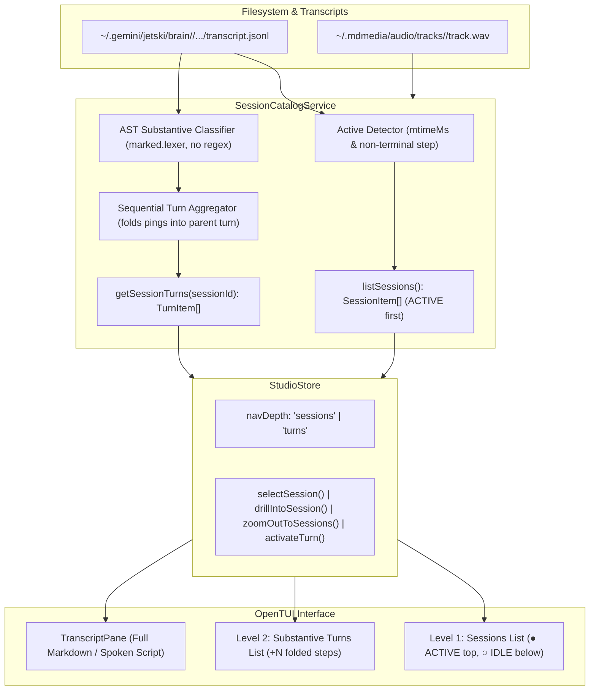

# Plan 006: Hierarchical Active-First Sessions and AST Small Message Aggregation in OpenTUI Studio

> **Executor instructions**: Follow this plan step by step. Run every
> verification command and confirm the expected result before moving to the
> next step. If anything in the "STOP conditions" section occurs, stop and
> report — do not improvise. When done, update the status row for this plan
> in `plans/README.md`.

## Status

- **Priority**: P1
- **Effort**: M
- **Risk**: LOW
- **Depends on**: plans 001-005
- **Category**: feature
- **Planned at**: commit `b626bc8`, 2026-09-16

---

## 1. Problem Definition & Objectives

### The Problem
1. **Message Fragmentation**: Antigravity/Jetski transcripts log small intermediate tool progress pings (e.g. *"I'll check the directory structure"*, *"Running tests..."*) as separate `PLANNER_RESPONSE` steps. Currently, every single ping appears as a separate turn card in the TUI, forcing users to click through dozens of 5-word snippets.
2. **Session Clutter**: When many sessions exist, an unorganized flat list of turns makes it difficult to locate the conversation the user is actively running.
3. **Fragmented Audio**: Synthesizing audio for small intermediate messages produces disjointed, choppy playback rather than a coherent verbal summary of the agent's complete answer.

### Objectives
1. **Active-First Session Sorting**: Detect whether an agent session is actively running (`● ACTIVE`) vs idle (`○ IDLE`), pinning active sessions to the top of the session list.
2. **Two-Level Miller Column / Drill-Down TUI**:
   - **Level 1 (Sessions List)**: Browse conversation sessions sorted by active status, then recency, displaying session intent title, substantive turn count, and folded step count.
   - **Level 2 (Turns List)**: Drill into the substantive turns of the selected session, with seamless navigation (`Enter` / `l` to drill in, `Esc` / `h` to zoom out).
3. **Deterministic AST-Based Small Message Aggregation (No Regex)**:
   - Use `marked.lexer` to inspect markdown structure tokens (`heading`, `table`, `list`) alongside word counts and in-flight `tool_calls`.
   - Fold intermediate tool pings into the subsequent substantive turn card (`+N folded steps`), keeping the library clean.
4. **Whole-Response Audio Generation**:
   - Selecting a substantive turn generates/plays audio for the entire comprehensive response (using `narrationAdapter` when configured), completely bypassing fragmented tool noise.

---

## 2. Proposed Architecture & Component Changes



---

## 3. Detailed Technical Design

### Component 1: `SessionCatalogService` (`src/studio/session-catalog.ts`)

#### 1.1 Active Session Detection
A session is actively executing if:
1. Transcript `mtimeMs` is within the active threshold (`Date.now() - stat.mtimeMs < 90_000`).
2. The last step in `transcript.jsonl` is uncompleted/in-flight:
   - `status === 'RUNNING'`, OR
   - `type === 'USER_INPUT'` (agent currently generating response to user prompt), OR
   - `type === 'PLANNER_RESPONSE'` with `tool_calls.length > 0` (agent awaiting tool execution output), OR
   - `type === 'GENERIC'` (background task or system notification in flight).
3. If `type === 'PLANNER_RESPONSE'`, `status === 'DONE'`, and `tool_calls.length === 0`, the agent has completed its answer and is awaiting human input (`IDLE`).

#### 1.2 Deterministic AST Substantive Classifier (No Regex)
Use `marked.lexer` AST tokens and a word counter:
```typescript
export interface SubstantiveClassificationOptions {
  minWords?: number; // default: 50
  minWordsWithStructure?: number; // default: 25
}

export function isSubstantiveResponse(
  content: string,
  hasToolCalls: boolean,
  options: SubstantiveClassificationOptions = {}
): boolean {
  const words = countWords(content);
  if (hasToolCalls && words < 150) {
    return false;
  }

  const minWords = options.minWords ?? 50;
  if (words >= minWords) {
    return true;
  }

  const minWordsWithStructure = options.minWordsWithStructure ?? 25;
  if (words >= minWordsWithStructure) {
    const tokens = lexer(content);
    // Simple structural token check on AST (zero regex)
    const hasStructure = tokens.some(
      (t) => t.type === 'heading' || t.type === 'table' || t.type === 'list'
    );
    if (hasStructure) {
      return true;
    }
  }

  return false;
}
```

#### 1.3 Small Message Aggregation / Sequential Folding
When parsing `transcript.jsonl`:
- Small intermediate responses (`!isSubstantiveResponse`) are collected into a `pendingFoldedSteps` buffer.
- When a substantive response (`isSubstantiveResponse`) is encountered:
  - It becomes a `TurnItem`.
  - It receives `foldedStepCount = pendingFoldedSteps.length` and `foldedSteps = [...pendingFoldedSteps]`.
  - `pendingFoldedSteps` is reset.
- If a conversation ends with only small messages (or intermediate progress), the final message is retained as a fallback turn so no active work is invisible.

#### 1.4 New `SessionItem` Model & Active-First Sorting
```typescript
export interface SessionItem {
  id: string; // full UUID: "ac52ca05-0fde-4734-a358-0b39f77b9c97"
  shortId: string; // "ac52ca05"
  title: string; // Intent extracted from prompt or first substantive turn
  isActive: boolean; // Currently executing
  mtimeMs: number;
  turnCount: number; // Substantive turns
  totalSteps: number; // Total raw steps
  foldedStepCount: number; // Total folded pings
  hasAudio: boolean; // True if any turn has cached audio
}
```
`listSessions()` sorts:
1. `isActive === true` first (sorted newest `mtimeMs` first).
2. `isActive === false` second (sorted newest `mtimeMs` first).

---

### Component 2: `StudioStore` & State Management (`src/studio/studio-store.ts`)

#### 2.1 State Additions (`StudioState` in `src/studio/types.ts`)
```typescript
export type NavigationDepth = 'sessions' | 'turns';

export interface StudioState {
  navDepth: NavigationDepth;
  sessions: SessionItem[];
  selectedSession: SessionItem | null;
  turns: TurnItem[];
  selectedTurn: TurnItem | null;
}
```

#### 2.2 Action Additions (`StudioAction` in `src/studio/types.ts`)
- `selectSession(sessionId: string): void`: Highlights session in Level 1 list.
- `drillIntoSession(sessionId?: string): void`: Switches `navDepth` to `'turns'`, loads substantive turns for the session, and selects the latest turn.
- `zoomOutToSessions(): void`: Switches `navDepth` to `'sessions'`, preserving current session focus.
- `activateTurn(id: string): Promise<void>`: Synthesizes or plays the entire substantive turn response, piping through `narrationAdapter` to create clean, coherent speech.

---

### Component 3: OpenTUI Interface (`src/tui/`)

#### 3.1 `LibraryPane` Presentation (`src/tui/components/library-pane.tsx`)
Render conditionally based on `navDepth`:
- **When `navDepth === 'sessions'`**:
  - Header: `Sessions (N total • M active)`
  - Cards:
    - Line 1: `▸ ● ACTIVE  ac52ca05 • Create a plan for the new TUI...`
    - Line 2: `    5 substantive turns • 14 folded steps • 12s ago`
  - Hint: `[Enter / l] View turns   [/] Search`
- **When `navDepth === 'turns'`**:
  - Breadcrumb: `← [Esc / h] ac52ca05 • ACTIVE (5 turns)`
  - Cards:
    - Line 1: `▸ ● Plan for new TUI layout`
    - Line 2: `    Turn #5 • 284 words • +3 folded steps`
  - Status badge: `▶` (playing), `●` (cached audio), `·` (ungenerated).

#### 3.2 Keybindings in `StudioApp` (`src/tui/app.tsx`)
- In `focusedPane === 'library'`:
  - When `navDepth === 'sessions'`:
    - `j` / `k` / `Down` / `Up`: Navigate session list.
    - `Enter` / `l` / `Right`: Drill into selected session (`drillIntoSession()`).
  - When `navDepth === 'turns'`:
    - `j` / `k` / `Down` / `Up`: Navigate turns.
    - `Esc` / `h` / `Left` / `Backspace`: Zoom out to sessions (`zoomOutToSessions()`).
    - `Enter`: Play / Synthesize whole substantive turn (`activateTurn()`).
  - Common:
    - `f`: Toggle audio-only filter.
    - `v`: Toggle markdown vs narration script view.
    - `y` / `Cmd+C`: Copy full substantive markdown to clipboard.
    - `/`: Search/filter sessions or turns.

---

## 4. Verification & Testing Strategy

### Unit Tests
1. **`test/studio/session-catalog-active.test.ts`**:
   - Verify `isSessionActive` returns `true` for sessions modified < 90s ago with `RUNNING`, `USER_INPUT`, or pending `tool_calls`.
   - Verify `isSessionActive` returns `false` for idle sessions (`DONE` with 0 `tool_calls`).
   - Verify `listSessions()` places active sessions at the top, followed by idle sessions sorted by recency.
2. **`test/studio/session-catalog-folding.test.ts`**:
   - Verify `isSubstantiveResponse` identifies paragraphs >= 50 words and structured AST elements (`heading`, `table`, `list`) without regex.
   - Verify intermediate tool pings (e.g. 8-word tool calls) are folded into `foldedStepCount` on the parent substantive turn.
   - Verify whole response content is preserved cleanly.
3. **`test/studio/studio-store-hierarchy.test.ts`**:
   - Verify `drillIntoSession()` and `zoomOutToSessions()` transition `navDepth` correctly.
   - Verify `activateTurn()` initiates synthesis of the complete substantive response.
4. **`test/standards/repo-standards.test.ts`**:
   - Verify zero internal codenames and strict headless separation (no `node:fs` in `src/tui/`).
